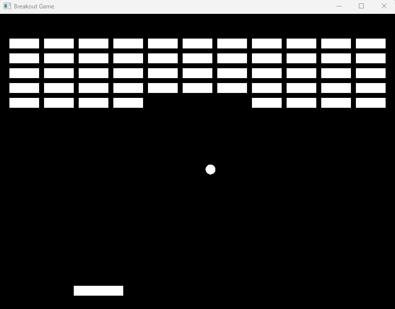

# Breakout Game (C++ / SFML)

A simple Breakout game implemented in C++ using SFML.  
This project was built to practice game loop, collision detection, and object-oriented design.

---

## 🎮 Features

- Paddle movement (left / right)
- Ball movement with delta time
- Collision with walls
- Collision with paddle
- Brick destruction system
- Game over condition

---

## 🧠 Concepts Used

- Game loop (update + render)
- Delta time for smooth movement
- Basic physics (velocity, bounce)
- Collision detection (AABB)
- Encapsulation (Paddle / Ball / Brick)
- STL (`std::vector`)

---

## 🕹 Controls

- `Left Arrow` → Move paddle left
- `Right Arrow` → Move paddle right

---

## 🛠 Tech Stack

- C++
- SFML
- CMake
- vcpkg

---

## 🚀 How to Run

1. Clone the repository:

```bash
git clone https://github.com/fulgeryk/Personal-Cpp-Projects.git
cd Breakout-Game
```

2. Build using CMake:

```bash
cmake -B build -S . -DCMAKE_TOOLCHAIN_FILE=vcpkg...
cmake --build build
```

3. Run:

```bash
./build/Debug/breakout_game.exe
```

---

## 📸 Screenshot



---

## 📌 Future Improvements

* Restart functionality
* Score system
* Better collision response (angles)
* Different brick types / colors
* Sound effects

---

## 💡 Notes

This project focuses on learning core game development concepts rather than advanced graphics or physics.

## 👤 Author

* Sorin Fulger
* GitHub: https://github.com/fulgeryk

