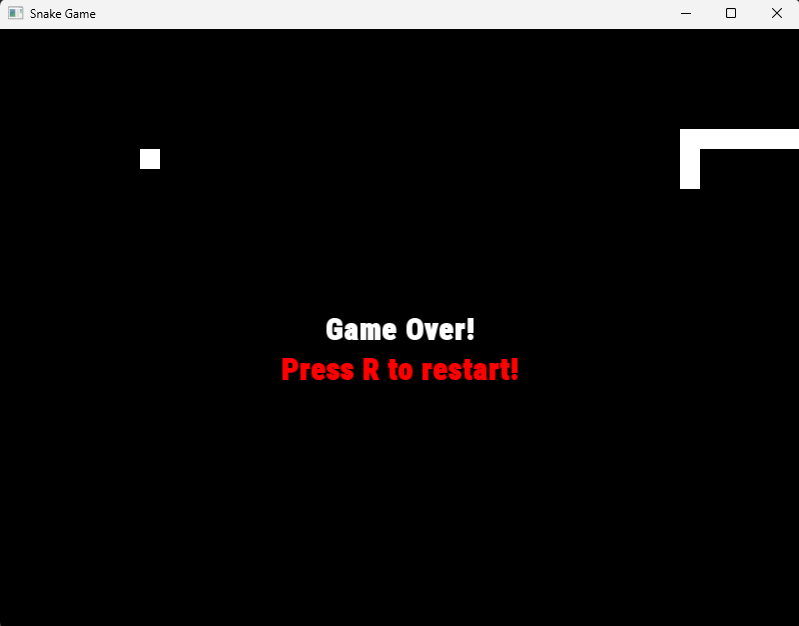

# 🐍 Snake Game (C++ / SFML)

A Snake game built in modern C++ using the SFML graphics library.
This project was developed to practice game loops, collision detection, and clean code structure.

---

## 🎮 Features

* Snake movement (Up / Down / Left / Right)
* Food spawning at random positions
* Snake grows when eating food
* Collision detection:

  * With walls
  * With itself
* Game Over screen
* Restart functionality (`Press R to restart`)
* Prevents reverse direction (no instant self-collision)

---

## 🧠 What I Learned

* Implementing a **game loop** using time-based updates (`std::chrono`)
* Separating **game logic** from **rendering**
* Handling **keyboard input** with SFML events
* Working with **2D grid systems**
* Collision detection techniques
* Managing game state (`running` vs `game_over`)
* Debugging real-world issues (state sync, rendering vs logic)

---

## 🛠️ Technologies Used

* **C++20**
* **SFML (Simple and Fast Multimedia Library)**
* **CMake**
* **fmt (for logging/debugging)**

---

## 🚀 How to Run

1. Clone the repository:

```bash
git clone <your-repo-link>
cd snake-game
```

2. Build using CMake:

```bash
cmake -B build -S . -DCMAKE_TOOLCHAIN_FILE=vcpkg...
cmake --build build
```

3. Run:

```bash
./build/snake_game
```

---

## 📸 Screenshot



---

## 📌 Notes

* The game uses a grid-based system (`cell_size`) for positioning.
* No raw pointers were used — relying on modern C++ containers (`std::vector`).
* The project focuses on clarity and learning, not optimization.

---

## 🔥 Future Improvements

* Score system
* Increasing speed over time
* Sound effects
* Better UI / animations
* Refactoring into separate `update()` and `render()` functions

---

## 👨‍💻 Author

* Sorin Fulger
* GitHub: https://github.com/fulgeryk